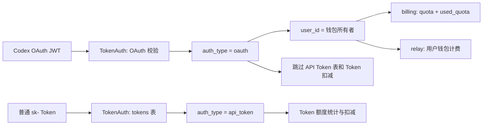

# Codex OAuth 钱包用量联调与修复报告

## 一句话结论

服务端已在本地修正 OAuth 身份与 API Token 的 ID 串号问题：Codex OAuth 现在按当前用户读取真实钱包 `quota / used_quota`，不再读到碰巧同 ID 的普通 Token 额度；代码和全量后端测试已通过，生产环境仍需部署后才会生效。

## 根因与修复

| 链路 | 修复前 | 修复后 |
|---|---|---|
| OAuth 上下文 | `token_id = OAuthServerAccessToken.Id` | `token_id = 0`，OAuth ID 单独存放 |
| 凭证类型 | 下游靠数字 ID 猜测 | 显式标记 `oauth` / `api_token` |
| Billing 数据源 | 可能读取同 ID 的 `tokens` 记录 | OAuth 始终按用户 ID 读取钱包 |
| Token 扣减 | OAuth 可能误操作普通 Token | OAuth 只扣用户钱包，跳过 API Token 记账 |
| JWT 鉴权顺序 | 先查 `tokens` 表，失败后再校验 OAuth | JWT 先走 OAuth 校验，不查 API Token 表 |
| 客户端周期 | 人为显示每月和重置日 | 钱包只显示剩余比例，无伪造周期 |



## 接口映射

客户端保留 OpenAI 兼容路径：

1. `GET /v1/dashboard/billing/subscription`
2. `GET /v1/dashboard/billing/usage`

服务端运行时换算公式：

```text
remaining_usd = quota / quota_per_unit
used_usd = used_quota / quota_per_unit
hard_limit_usd = (quota + used_quota) / quota_per_unit
total_usage = used_usd * 100
remaining_percent = quota / (quota + used_quota) * 100
```

`total_usage` 是 OpenAI 兼容字段，单位为美分。`quota_per_unit` 必须读取运行时配置，不能写死。

## 代码变更

| 范围 | 关键文件 | 作用 |
|---|---|---|
| 凭证语义 | `constant/context_key.go` | 增加凭证类型和独立 OAuth ID |
| 鉴权 | `middleware/auth.go` | JWT OAuth 先验证，分离两类 Token 上下文 |
| 额度读取 | `controller/billing.go` | OAuth 读用户钱包，API Token 保留 Token 统计 |
| Relay 归因 | `relay/common/relay_info.go` | 凭证类型传递到计费链路 |
| 扣费 | `service/billing_session.go`、`service/quota.go` | OAuth 不读写普通 Token 额度 |
| 发布构建 | `Makefile` | Bun workspace 使用隔离依赖布局 |
| 长期规则 | `AGENTS.md` | 固化身份、额度、日志和回归测试边界 |

## 验证结果

| 验证 | 结果 | 覆盖内容 |
|---|---:|---|
| 红灯回归 | 按预期失败 | ID 碰撞时 OAuth 错读 5 美元 Token |
| 认证边界 | 6/6 通过 | 正常、撤销、scope、普通 Key、上下文、SQL 查询边界 |
| 受影响包 | 5/5 通过 | controller、middleware、router、relay/common、service |
| 定向竞态检查 | 5/5 通过 | 本次 OAuth 与额度用例 |
| 前端构建 | 2/2 通过 | default 和 classic Web |
| 后端全量测试 | 通过 | `go test ./... -count=1` |
| 客户端用量测试 | 5/5 通过 | 美分换算、剩余比例、无伪造重置时间 |

全包 `-race` 仍会在既有视频任务轮询测试中报告竞态，主要位于 `service/task_polling_test.go`、`service/task_polling.go` 和 `logger/logger.go`。它与本次 OAuth 链路无关，应单独立项修复。

## 部署顺序

1. 审查并提交服务端变更。
2. 按现有发布方式部署服务端，确认数据库连接和 `quota_per_unit` 配置正常。
3. 使用测试 OAuth 账号请求两个 billing 接口，与网页控制台即时值核对。
4. 服务端验收通过后，重打 macOS / Windows 客户端，避免用旧客户端的伪月度周期展示。
5. 客户端验收头像菜单和“使用情况和计费”页，确认数值与网页一致且无月度重置日。

## 生产验收命令

在本机临时环境变量中保存测试 OAuth access token，不要写入脚本、命令历史或日志：

```bash
curl -sS \
  -H "Authorization: Bearer ${RUIZHI_OAUTH_ACCESS_TOKEN}" \
  https://gptauth.ruijie.com.cn/v1/dashboard/billing/subscription

curl -sS \
  -H "Authorization: Bearer ${RUIZHI_OAUTH_ACCESS_TOKEN}" \
  https://gptauth.ruijie.com.cn/v1/dashboard/billing/usage
```

验收时应满足：

| 校验项 | 通过标准 |
|---|---|
| 已用金额 | `total_usage / 100` 与网页历史消耗一致 |
| 总额度 | `hard_limit_usd` 与网页余额加历史消耗一致 |
| 当前余额 | `hard_limit_usd - total_usage / 100` 与网页余额一致 |
| 账号隔离 | 不同 OAuth 用户不得读到相同的 Token 统计 |
| 时间口径 | 钱包不显示虚构的“每月”和重置日 |

## 当前边界

- 已完成：服务端和客户端本地代码、回归测试、构建验收。
- 未完成：生产服务端部署、真实账号接口复验、新客户端打包与安装。
- 安全操作：任何已出现在聊天或截图中的 GitHub Token 都应立即撤销并重新生成。
