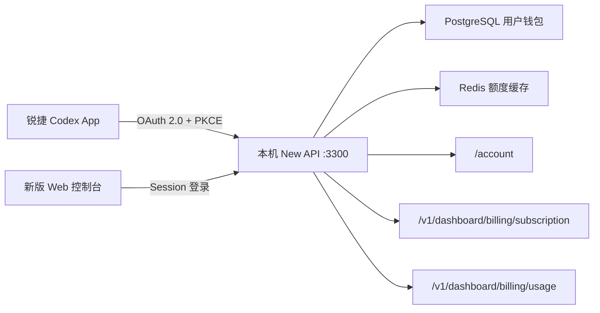

# 锐捷 Codex 计费服务本机 Docker 验收记录

## 一句话结论

本机已部署完整 New API 服务，包含新版 Web 控制台、Go 服务、PostgreSQL 和 Redis；OAuth 登录及 Codex 计费接口已完成真实动态数据验收。

## 当前访问方式

| 项目 | 当前值 |
|---|---|
| 控制台 | `http://127.0.0.1:3300` |
| 管理员用户名 | `admin` |
| 管理员密码 | 保存在 macOS 钥匙串，服务名 `ruijie-new-api-local-admin` |
| 网络范围 | 仅监听本机 `127.0.0.1`，不暴露到局域网 |
| 数据库 | PostgreSQL 15，Docker 数据卷持久化 |
| 缓存 | Redis 7，Docker 数据卷持久化 |
| 前端 | Default 新版前端，已切换简体中文 |

如需在普通浏览器登录，可先把密码复制到系统剪贴板：

```bash
security find-generic-password \
  -a admin \
  -s ruijie-new-api-local-admin \
  -w | pbcopy
```

密码不会写入仓库、Compose 文件或日志。

## 日常操作

在 `new-api` 目录执行：

```bash
# 构建并启动完整服务
make local-up

# 查看服务状态
make local-status

# 查看服务日志
make local-logs

# 停止服务，保留全部数据
make local-down
```

直接删除 Docker 数据卷会清空账号、额度、OAuth 授权和配置；正常停止不应使用 `down -v`。

## 架构



## 动态计费验收

本机测试钱包设置为非整值，用来排除客户端或服务端写死 `100%` 的假通过：

| 数据源/页面 | 验收结果 |
|---|---:|
| PostgreSQL 剩余额度 | 37,500,000 quota units |
| PostgreSQL 已用额度 | 12,500,000 quota units |
| Codex 总额度 | US$100 |
| Codex 已使用 | US$25 |
| Codex 剩余额度 | US$75 |
| Codex 剩余比例 | 75% |
| 新版控制台历史使用 | US$25 |
| 新版控制台剩余额度 | US$75 |

验收链路实际执行了：

1. 本机账号密码登录。
2. OAuth 2.0 Authorization Code + PKCE 授权。
3. 签发 access token、refresh token 和 id token。
4. 使用 OAuth access token 调用 `/account`。
5. 使用同一 OAuth access token 调用两个 Codex 计费接口。
6. 登录新版控制台，核对 Web 页面与接口结果一致。

测试过程中没有把 OAuth token、管理员密码或 GitHub token写入代码和文档。

## 当前边界

本机验收证明了服务端、数据库、OAuth 和计费接口可用，但还没有把已安装的锐捷 Codex App 切到本机 `http://127.0.0.1:3300`。下一步需修改客户端本地服务地址并重新启动客户端，然后核对头像菜单的“剩余用量”和“使用情况和计费”页面。

生产部署仍应使用 HTTPS 域名、生产数据库密码、安全 Session Cookie 和受控备份；本机 Compose 只用于开发验收。
